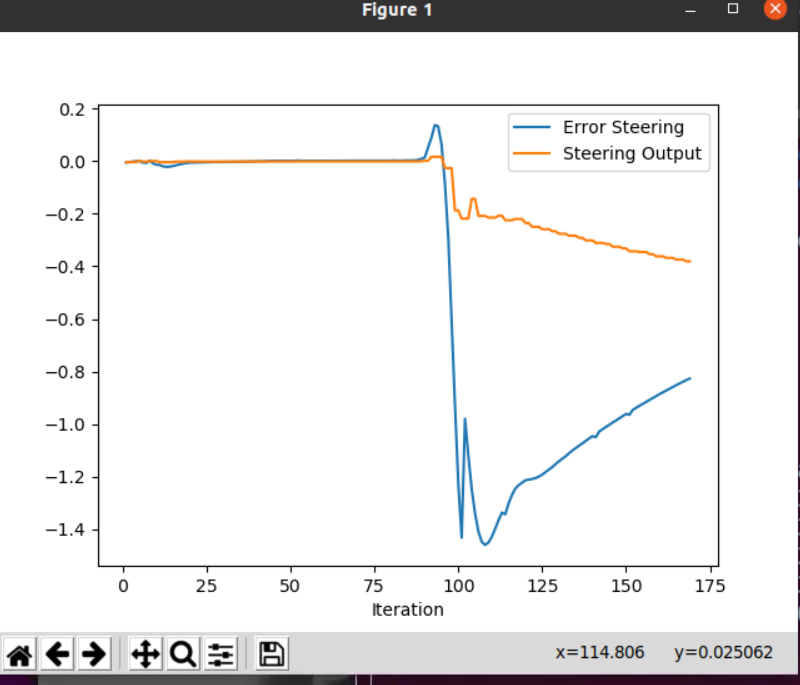

# PID Controller Simulation Analysis

## Plotting the Results of the Simulation

The results of the simulation are visualized using plots generated from the recorded controller data. These plots are included in the accompanying report and demonstrate how the system evolves over time under the action of the PID controller.

Figure 1 illustrates the system response and clearly shows the **convergence behavior** of the controller, where the control error decreases over time and stabilizes at steady state.

*Figure 1: PID controller response showing convergence of the control error and stabilization of the control command.*

---

## Analyzing the Plots

The plots show the following variables:
- **Time** (x-axis)
- ** Error **

The car didn't do that well, seems like all the other stuff needs to be incorporated and out of workspace budget.

How would you design a way to automatically tune the PID parameters? This is an open question, the coherence and justification of the answer is valued.
Twiddle algorithm, something to close the loop

Find at least 2 pros and cons for model free versus model based.
Pros - if you don't know the model can dervice, more flexible as things change

Cons - more computation power need
hards to defend
